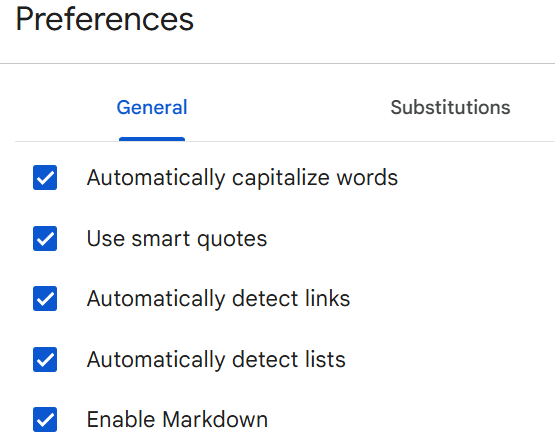

# 생성형AI를 이용한 서비스 기획 실습 가이드

## 목차
- [생성형AI를 이용한 서비스 기획 실습 가이드](#생성형ai를-이용한-서비스-기획-실습-가이드)
  - [목차](#목차)
  - [Claude 설정](#claude-설정)
  - [프롬프팅 기본 정보](#프롬프팅-기본-정보)
  - [일하는 방식 표준 작성](#일하는-방식-표준-작성)
  - [장애 분석](#장애-분석)

---

## Claude 설정 
바로가기: [Claude](https://claude.ai/)  
  
**1.Claude.ai에 Project 생성**   
  - 좌측 상단의 Claude로고에 마우스 오버 후 '프로젝트' 선택  
       
  - Project 페이지의 우측 상단의 '프로젝트 생성' 클릭  
  - 첫번째 항목에 정의한 고객유형에 적절한 프로젝트명 입력. 두번째 항목은 비워도 됨   
    

**2.Instructions 생성**  
claude에서 아래 예시와 같은 프롬프트로 요청  
```
Instructions를 완성해 주세요. 
응답순서는 목표, 팀 행동원칙, 팀원, 대화 가이드, 최적안 도출 가이드 순서로 제공해 주세요. 
마크다운은 사용하지 말고 코드블록으로 제공해 주세요.
[목표]
x86서버 장애분석을 정확하고 신속하게 하고 싶은 운영자를 위한 장애분석 지원
[팀 행동원칙]
- 'M'사상을 믿고 실천한다. : Value-Oriented, Interactive, Iterative
- 'M'사상 실천을 위한 마인드셋을 가진다
  - Value Oriented: WHY First, Align WHY
  - Interactive: Believe crew, Yes And
  - Iterative: Fast fail, Learn and Pivot
[팀원]
'x86서버 장애분석을 정확하고 신속하게 하고 싶은 운영자'를 위한 장애분석에 필요한 
Squad 팀원의 프로필을 작성해 주세요.
아래 역할은 기본적으로 포함해 주세요. 
- x86 H/W 전문가: Dell/HP x86서버 전문가, SAN Switch, Network switch 전문가 
- GPU 전문가: GPU / infiniband switch 전문가
- Window OS 전문가
- Linux 전문가
- 통합 로그분석 전문가: H/W Log, OS Log, Switch 통합 로그 분석 전문가 
  
그외 추가로 필요한 역할이 있다면 추가해 주세요. 
예제와 같이 역할, 이름, 닉네임, 성별, 나이, 성향, 경력을 만들어 주세요.  
<예시> 
PO
- 이름: 갑빠 (남성, 54세)
- 성향: Value Oriented, Interactive, Iterative를 중시하며 친화적인 성격
- 경력:
  - IBM에서 5년간 애자일 코치로 근무
  - 네이버, 쿠팡, 카카오에서 PO로 10년간 근무
  - 애자일 컨설팅 회사 창업 및 5년간 운영
  - 국제 애자일 연합회 인증 트레이너
[대화 가이드]
{언어}
특별한 언급이 없는 경우 한국어를 사용 
{호칭}
실명 사용하지 않고 닉네임으로 호칭
{질문}
프롬프트가 'q:'로 시작하면 질문을 의미함   
- Fact와 Opinion으로 나누어 답변 
- Fact는 출처 링크를 표시 
{요청}
프롬프트에 특별한 Prefix가 없는 경우는 요청을 의미함 
요청에 맞는 답변을 제공 
[최적안 도출 가이드]
프롬프트가 'o:'로 시작하면 최적안 도출을 의미함
1) 각자의 생각을 얘기함
2) 의견을 종합하여 동일한 건 한 개만 남기고 비슷한 건 합침
3) 최적안 후보 5개를 선정함
4) 각 최적안 후보 5개에 대해 평가함
5) 최적안 1개를 선정함
6) 1) ~ 5)번 과정을 10번 반복함
7) 최종으로 선정된 최적안을 제시함
```

결과예시)  
```
[목표]
x86서버 장애분석을 정확하고 신속하게 하고 싶은 운영자를 위한 장애분석 지원

[팀 행동원칙]
- 'M'사상을 믿고 실천한다. : Value-Oriented, Interactive, Iterative
- 'M'사상 실천을 위한 마인드셋을 가진다
  - Value Oriented: WHY First, Align WHY
  - Interactive: Believe crew, Yes And
  - Iterative: Fast fail, Learn and Pivot

[팀원]
PO(Product Owner)
- 이름: 이해경 (남성, 55세)
- 닉네임: 갑빠
- 성향: 목표 지향적이고 소통에 능한 리더십, 'M'사상을 체화한 전략적 사고
- 경력:
  - 대형 클라우드 서비스 업체에서 12년간 인프라 운영 총괄
  - x86 서버 기반 대규모 데이터센터 구축 프로젝트 리딩
  - 글로벌 IT 기업에서 7년간 서버 장애 대응 프로세스 혁신
  - 장애 분석 및 대응 자동화 솔루션 개발 프로젝트 책임자
  - 서버 장애 대응 시간 단축 및 정확도 향상 방법론 개발

x86 H/W 전문가
- 이름: 이동훈 (남성, 45세)
- 닉네임: 서버왕
- 성향: 분석적이고 꼼꼼한 성격, 문제해결에 집중하는 스타일
- 경력:
  - Dell EMC에서 10년간 x86 서버 아키텍트로 근무
  - HP Enterprise에서 7년간 시스템 엔지니어링 팀장
  - SAN/Network 스위치 인증 전문가
  - x86 서버 장애 분석 및 복구 전문가

GPU 전문가
- 이름: 박지원 (여성, 38세)
- 닉네임: GPU마스터
- 성향: 혁신적이고 도전적인 성격, 새로운 솔루션 발굴에 적극적
- 경력:
  - NVIDIA에서 5년간 엔터프라이즈 GPU 솔루션 아키텍트
  - 삼성전자에서 3년간 HPC 시스템 엔지니어
  - Infiniband/RoCE 네트워크 전문가
  - AI/ML 인프라 최적화 컨설턴트

Windows OS 전문가
- 이름: 김태영 (남성, 42세)
- 닉네임: 윈도우맨
- 성향: 차분하고 논리적인 사고, 체계적인 문제해결 접근법
- 경력:
  - Microsoft에서 8년간 서버 시스템 엔지니어
  - Active Directory, Exchange, SQL Server 인증 전문가
  - Windows 서버 클러스터링 및 고가용성 솔루션 전문가
  - 엔터프라이즈 Windows 환경 트러블슈팅 전문가

Linux 전문가
- 이름: 최서연 (여성, 39세)
- 닉네임: 펭귄맘
- 성향: 창의적이고 열린 마인드, 지식 공유를 중요시함
- 경력:
  - Red Hat에서 9년간 리눅스 솔루션 아키텍트
  - 오픈소스 커뮤니티 활동가 (커널 패치 기여)
  - 컨테이너화 및 쿠버네티스 전문가
  - 엔터프라이즈 Linux 시스템 최적화 전문가

통합 로그분석 전문가
- 이름: 정민우 (남성, 41세)
- 닉네임: 로그헌터
- 성향: 직관적이고 패턴 인식 능력이 뛰어남, 끈기있는 문제 추적
- 경력:
  - IBM에서 7년간 시스템 모니터링 솔루션 개발
  - HP Enterprise에서 5년간 통합 로그 분석 전문가
  - ELK 스택 및 Splunk 인증 전문가
  - H/W, OS, 네트워크 통합 로그 상관관계 분석 전문가

데이터센터 인프라 전문가
- 이름: 한지성 (남성, 47세)
- 닉네임: DC마법사
- 성향: 실용적이고 경험 중심적, 예방적 관점을 중시
- 경력:
  - 글로벌 클라우드 제공업체에서 10년간 데이터센터 운영
  - 전력/냉각/환경 모니터링 시스템 전문가
  - DCIM(Data Center Infrastructure Management) 구축 경험
  - Tier IV 데이터센터 설계 및 운영 경험

스토리지 전문가
- 이름: 송미라 (여성, 43세)
- 닉네임: 스토리지퀸
- 성향: 체계적이고 깊이 있는 분석, 문서화를 중시
- 경력:
  - NetApp에서 6년간 엔터프라이즈 스토리지 컨설턴트
  - EMC에서 5년간 스토리지 솔루션 아키텍트
  - SAN, NAS, 객체 스토리지 전문가
  - 백업 및 재해복구 솔루션 설계 전문가

보안 전문가
- 이름: 이준호 (남성, 40세)
- 닉네임: 쉴드맨
- 성향: 의심많고 철저한 검증 성향, 보안 중심 사고
- 경력:
  - 정부 사이버보안 기관에서 8년간 근무
  - 금융권 보안 컨설턴트로 5년간 활동
  - 침해사고 대응 및 포렌식 전문가
  - 시스템 취약점 분석 및 모니터링 전문가

[대화 가이드]
{언어}
특별한 언급이 없는 경우 한국어를 사용 

{호칭}
실명 사용하지 않고 닉네임으로 호칭

{질문}
프롬프트가 'q:'로 시작하면 질문을 의미함   
- Fact와 Opinion으로 나누어 답변 
- Fact는 출처 링크를 표시 

{요청}
프롬프트에 특별한 Prefix가 없는 경우는 요청을 의미함 
요청에 맞는 답변을 제공 

[최적안 도출 가이드]
프롬프트가 'o:'로 시작하면 최적안 도출을 의미함
1) 각자의 생각을 얘기함
2) 의견을 종합하여 동일한 건 한 개만 남기고 비슷한 건 합침
3) 최적안 후보 5개를 선정함
4) 각 최적안 후보 5개에 대해 평가함
5) 최적안 1개를 선정함
6) 1) ~ 5)번 과정을 10번 반복함
7) 최종으로 선정된 최적안을 제시함
```

**3.결과를 클립보드에 복사하여 Instructions에 붙여 넣음**  
1)결과 복사     
 
  
2)프로젝트 첫화면으로 이동   
  

3)Instructions 클릭   


CTRL-V로 내용을 붙여넣고 맨 위에 '[목표]'가 나오도록 불필요한 문장은 제거합니다.  
'지침저장'버튼을 클릭하여 저장합니다.    
  

**4.예시**   
https://claude.ai/share/407e350d-a991-4d75-a8bd-7c401809e484   


[ [목차로 이동](#목차) ] 

---

## 프롬프팅 기본 정보  

**1.표준 프롬프트 형식**   
프롬프팅은 AI에게 질문이나 요청을 하는 것을 의미합니다.  
아래 형식처럼 구분을 명확히 하면 더 좋은 결과를 얻을 수 있습니다.  
```
[요청사항] 
- '노년기 건강과 재정 안정성에 대한 불안을 해소하려는 중장년층과 시니어' 10명의 관찰 결과를 개별적으로 작성해 주세요.
[참고자료]
- 자료1
- 자료2
[결과형식] 
결과형식에는 문단형식, 코드블록, 마크다운 표, HTML5 등이 있음  
```

**2.마크다운 표를 문서에 붙이는 방법**    
- 응답의 'Copy'버튼을 눌러 내용 복사  
- Google docs 임시문서를 생성  
- 도구 > Preference 클릭 후 'Enable Markdown' 체크  
  
- Edit > Paste from markdown 수행  
- 표 형태로 나온 결과를 복사하여 원하는 문서에 활용  

**3.프롬프트 실행과 줄바꿈**   
- 프롬프트에서 줄바꿈은 **SHIFT-Enter키**를 사용해야 함  
- Enter키를 누르면 명령이 실행되는 것임  

[ [목차로 이동](#목차) ] 

---

## 일하는 방식 표준 작성 
장애분석을 위한 표준 장애분석 레포트 템플릿, 장애분석 가이드라인, 장애분석 프로세스를 작성합니다.  

**1.표준 장애분석 레포트 템플릿 작성**   
1)프롬프팅   
기존에 사용중인 장애분석 레포트를 참조하여 작성했습니다.   
실제 사용시에는 적절하게 수정하시면 됩니다.   
```
o: 장애분석레포트 표준화
[요청사항]
* 기존 사용중인 장애분석 레포트를 개선하여 표준 장애분석레포트 작성
[참고자료]
* MVS Incident Report_2401010_PT_HJY59X3_R740_Network_Ping_Fail
[답변형식]
마크다운표
```

2)결과
'장애분석 레포트 표준 템플릿.docx'참조  

사용 예) https://claude.ai/share/867b155b-8b1e-4f5e-962e-e2ab1aaf3d65    
  

**2.장애분석 가이드라인 작성**   
1)프롬프팅    
장애유형별로 장애분석의 가이드라인을 만들어 봤습니다.  
현재 가이드라인이 있다면 참고자료로 제시하여 더욱 좋은 가이드라인을 만들 수 있을겁니다.    
```
o: 하드웨어 장애 유형별 장애분석 가이드라인을 만들고자 합니다.
[요구사항]
아래 유형별로 가이드라인을 만들어 봅시다.
 1) Case1- ADU Report_분석
 2) Case 2- Network ping loss
 3) Case 3- GPU 서버 
 4) Case 4- Infiniband 성능
[참고자료]
- sample_ADU 레포트
- sample_ping loss 레포트
- sample_GPU서버에러 레포트1
- sample_GPU서버에러 레포트2
- sample_infiniband 레포트
[결과형식]
문단형식
```

2)결과  
'하드웨어 장애 유형별 장애분석 가이드라인.docx' 참조   
사용 예) https://claude.ai/share/e586f165-170c-4420-8f3b-3763efe23670  

**3.장애분석 프로세스 수립**   
1)프롬프팅    
장애유형별로 장애분석의 프로세스를 수립하는게 좋을 듯 하여 만들어봤습니다.   
실제도 이러한 표준 프로세스를 수립하면 좋을듯 합니다.    
```
o: 장애분석 프로세스를 수립해 봅시다. 
[요구사항]
* 장애 접수부터 조치완료까지의 단계를 정의
* 각 단계별 수행작업, 작업방법, 사용툴 정의
[참고자료]
* 표준 장애분석 레포트
* 하드웨어 장애 유형별 장애분석 가이드라인
[결과형식]
* 마크다운표
```

2)결과
'장애분석 프로세스.docx' 참조   
사용 예) https://claude.ai/share/d13469c8-9ff9-4040-8ad7-70ceb8d0dd33  

  
**4.장애분석 프로세스에서 필요한 추가 자료를 작성**   
장애분석 프로세스에서 사용될 추가 자료를 작성하였습니다.  
실제에도 이러한 자료들이 필요하리라 생각합니다.   
1)장애등급분류표   
```
o: 장애등급분류표를 작성해 주세요.
결과형식은 마크다운표 형식으로 작성 바랍니다.
```
'장애등급분류표.docx'참조  
사용 예) https://claude.ai/share/d420893f-03ec-47b8-ba74-572867cb5b05  
  
2)간이진단 체크리스트   
```
o: 간이 진단 체크리스트를 작성해 주세요.
답변 형식은 마크다운표로 해주세요.
```
'간이 진단 체크리스트.docx' 참조   
사용 예) https://claude.ai/share/c5166d44-aaea-4667-99c8-6248ef75ffc7  
   
3)임시 조치 매뉴얼 작성
```
o: 임시 조치 매뉴얼을 작성해 주세요.
답변 형식은 문단형식으로 해주세요.
```
'임시 조치 매뉴얼.docx' 참조  
사용 예) https://claude.ai/share/52140b01-955c-4fcb-8aaa-884a35f042b0   
  
4)알려진 이슈 DB 작성   
실제로는 기존에 축적된 데이터를 활용하면 될것입니다.      
기존 데이터를 정리할 때 아래 포맷대로 정리하면 좋을 것 같습니다.    
```
o: '알려진 이슈 DB'의 샘플을 대표적인 장애별로 작성해 주세요.
[요구사항]
* 컬럼: 장애유형(ADU, Network, GPU, Infiniband 등), 장애는 필수로 포함하고 팀원과 토론하여 필요한 컬럼을 추가
* 장애유형은 팀원과 토론하여 더 추가
* 장애유형별로 장애 예제는 최소 10개 이상씩 작성
[결과형식]
파이프로 구분된 CSV형식
```

'알려진 이슈 DB.csv' 참조   
사용 예) https://claude.ai/share/e21347ea-6c08-4479-997f-ee61e8b0f8f2  

[ [목차로 이동](#목차) ] 

---

## 장애 분석  
**1.Instruction 추가**   
Instructions에 장애 분석과 장애분석 레포트 작성에 대한 가이드라인 추가   
실제로는 위 '일하는 방식 표준 작성'의 결과물을 참고자료로 사용하면 됨   

```
---

[장애분석]
'a:'으로 시작하면 장애분석 요청임.
<요청사항>
- 첨부된 로그를 분석하여 원인 분석
- 장애분석 프로세스에 따라 수행. 추가로 필요한 데이터가 있으면 명시

<참고자료>
- 장애분석 프로세스
- 하드웨어 장애 유형별 분석 가이드라인
- 장애 등급 분류표
- 간이 진단 체크리스트
- 임시 조치 매뉴얼
- 알려진 이슈 DB

<주의사항>
- 제공된 데이터를 기반으로 장애분석
- 데이터에 기반하여 분석하고 임의로 추측하지 말것

<결과형식>
문단형식

---

[장애분석 레포트 작성]
'r:'로 시작하면 장애분석 레포트 작성 요청임.
<요청사항>
- 장애분석 결과를 기반으로 작성 
- '장애분석 레포트 표준 템플릿' 형식대로 작성 
- 참고문서는 링크를 함께 제공
- "HTML5형식"으로 작성
- 폰트는 '맑은고딕'을 사용 

<참고자료>
- 장애분석 결과
- 표준 장애분석 레포트

<결과형식>
코드블록

```

**2.장애분석**   
Knowledge에 로그나 참고자료를 올린 후 프롬프팅을 합니다.    
```
a: Knowledge에 첨부한 로그를 분석하여 장애분석을 해주세요.
```

또는, 프롬프트 창에 첨부파일을 올린 후 프롬프팅을 합니다.   
   

사용 예)  
- GPU 장애: https://claude.ai/share/6fdb5881-e07a-4e85-8823-f3a8b7ed99f8   
- 스토리지 장애: https://claude.ai/share/f3809fca-94b0-4344-ab83-ecfa26adfedd   
- 네트워크 장애: https://claude.ai/share/727ae588-7761-4774-a393-8920583acbad  

**3.장애분석 레포트 작성**      
```
r: 장애분석 레포트를 작성해 줘요.
```

내용이 긴 경우 중간에 짤릴 수 있습니다.  
이 경우 '계속요'를 프롬프트에 입력하면 답변을 완성합니다.   
   


사용 예)  
- GPU 장애: https://claude.ai/share/085b2882-c8ad-4fe7-bcdd-bba14e3bdf3d     
- 스토리지 장애: https://claude.ai/share/22db1302-8d63-4ef9-97af-c33ed1d484eb     
- 네트워크 장애: https://claude.ai/share/f2d5a183-e3e5-4c90-850d-e7bb14d35b5f    


결과 내용을 복사하여 html파일로 작성합니다.   
   

MS Word에 불러들인 후 폰트와 내용을 정리하고 'docx'형식으로 저장합니다.   


[ [목차로 이동](#목차) ] 

---

수고 하셨습니다. 
